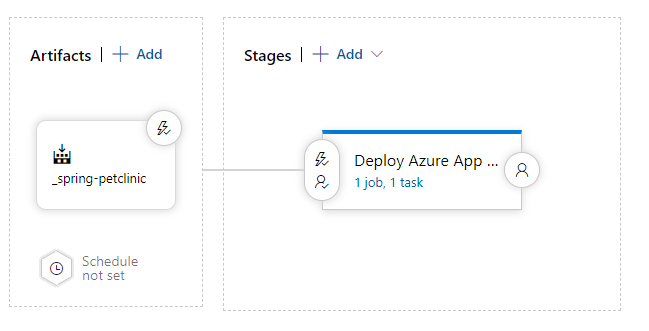
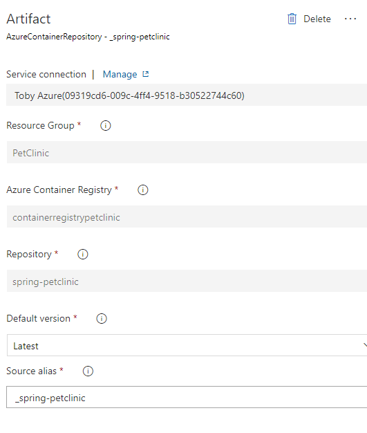
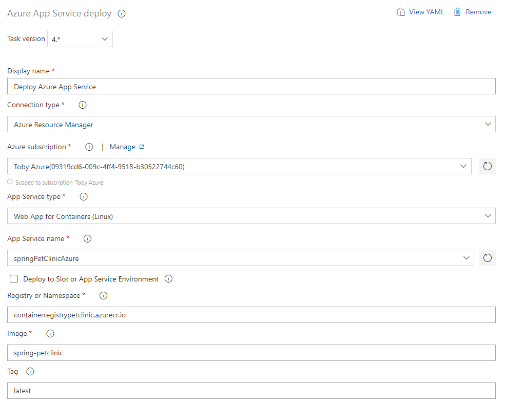

[](https://dev.azure.com/tobyn0394/tobyn/_build/latest?definitionId=1&branchName=main)


# spring-pet-clinic-azure
https://github.com/spring-petclinic

# installing Azurez CLI
https://docs.microsoft.com/nl-nl/cli/azure/install-azure-cli-macos

# azure pipeline cache
https://docs.microsoft.com/en-us/azure/devops/pipelines/release/caching?view=azure-devops

The Cache task has two required inputs: key and path.

## Path input
path should be set to the directory to populate the cache from (on save) and to store files in (on restore). It can be absolute or relative. Relative paths are resolved against $(System.DefaultWorkingDirectory).
## Key input
key should be set to the identifier for the cache you want to restore or save. Keys are composed of a combination of string values, file paths, or file patterns, where each segment is separated by a | character.
* Strings:
fixed value (like the name of the cache or a tool name) or taken from an environment variable (like the current OS or current job name)

* File paths:
path to a specific file whose contents will be hashed. This file must exist at the time the task is run. Keep in mind that any key segment that "looks like a file path" will be treated like a file path. In particular, this includes segments containing a .. This could result in the task failing when this "file" does not exist.

* File patterns:
comma-separated list of glob-style wildcard pattern that must match at least one file. For example:

```**/yarn.lock```: all yarn.lock files under the sources directory
```*/asset.json, !bin/**```: all asset.json files located in a directory under the sources directory, except under the bin directory

## Restore keys
restoreKeys can be used if one wants to query against multiple exact keys or key prefixes. This is used to fallback to another key in the case that a key does not yield a hit. A restore key will search for a key by prefix and yield the latest created cache entry as a result. This is useful if the pipeline is unable to find an exact match but wants to use a partial cache hit instead. To insert multiple restore keys, simply delimit them by using a new line to indicate the restore key (see the example for more details). The order of which restore keys will be tried against will be from top to bottom.

## Maven caching setup
```
variables:
  MAVEN_CACHE_FOLDER: $(Pipeline.Workspace)/.m2/repository
  MAVEN_OPTS: '-Dmaven.repo.local=$(MAVEN_CACHE_FOLDER)'

steps:
- task: Cache@2
  inputs:
    key: 'maven | "$(Agent.OS)" | **/pom.xml'
    restoreKeys: |
      maven | "$(Agent.OS)"
      maven
    path: $(MAVEN_CACHE_FOLDER)
  displayName: Cache Maven local repo
```
In this example the key is the static string "maven", the OS the job is running on and hash of the pom.xml.
The cache will be created from $(Pipeline.Workspace)/.m2/repository

Note: If you are using a Maven task, make sure to also pass the MAVEN_OPTS variable because it gets overwritten otherwise:
```
task: Maven@3
  inputs:
    mavenPomFile: 'pom.xml'
    mavenOptions: '-Xmx3072m $(MAVEN_OPTS)'
```

## Buildpacks setup
### What are Cloud Native Buildpacks?
From https://buildpacks.io/:
*Cloud Native Buildpacks transform your application source code into images that can run on any cloud.*

Add the following to the [pom.xml](https://github.com/TobyNijman/spring-pet-clinic-azure/blob/main/pom.xml).
```
<configuration>
          <image>
            <name>containerregistrypetclinic.azurecr.io/${project.artifactId}:latest</name>
          </image>
          <layers>
            <enabled>true</enabled>
            <includeLayerTools>true</includeLayerTools>
          </layers>
        </configuration>
```
In the snippet above the name contains the containerRegistry present on azure and the resulting image name and version.

To use buildpacks in the azure pipeline you will need to change the maven command used.

The new maven build step is defined as follows:
```
- task: Maven@3
  displayName: Build
  inputs:
  mavenPomFile: 'pom.xml'
  mavenOptions: '-Xmx3072m $(MAVEN_OPTS)'
  goals: 'spring-boot:build-image'
  publishJUnitResults: false
```

##Publishing the build image to azure
To push to the azure container registry we can add the following step in the pipeline.
```
    - task: Docker@2
      displayName: Push Docker image
      inputs:
        containerRegistry: 'containerregistrypetclinic'
        repository: 'spring-petclinic'
        command: 'push'
        tags: 'latest'
```

##Deploying the image
Done by creating a release pipelines which deploys to a custom container app service on every image version update.
<br/>

<br/>
Steps:
1. go to https://dev.azure.com/
2. go to releases
3. create new release pipeline
4. Select Azure app service deployment
5. Add an artifact
    - azure container registry
    - select the containerregistry, image, version etc
    - By clicking on the lightning bolt a Continuous deployment trigger can be setup. 
      This creates a release every time an image is pushed to the selected repository.
    - If another artifact type is selected this trigger can be setup on different events
    <br/>
    
    <br/>
      
6. Go to Stages and click on job/task link at the bottom
7. click unlink all
8. setup the correct image name etc for the deploy Azure App Service task
    <br/>
    
    <br/>
   
    - The resulting yaml for the task will look like this:
    ```
    steps:
    - task: AzureRmWebAppDeployment@4
      displayName: 'Deploy Azure App Service'
      inputs:
      azureSubscription: <You azure subscription>
      appType: webAppContainer
      WebAppName: springPetClinicAzure
      DockerNamespace: <azure container registry url> #Example: test.azurecr.io
      DockerRepository: <docker repository>
      DockerImageTag: latest
    ```

###Port configuration
For the spring pet store the application was not visible for the app service at first and showed an error instead of the pet store, this was due to the port configuration.

By default, the App Service for the custom container will listen to port 80. To change this, configure the WEBSITES_PORT configuration in the App Service. 
This is also possible via the shell.
```
//Azure CLI
az webapp config appsettings set --resource-group <group-name> --name <app-name> --settings WEBSITES_PORT=8000
```

##(Unit) testing best practices
**(WIP)**

- Using the Give, When, Then structure:
    ```
    public void findProduct() {
        // Given
        insertIntoDatabase(new DTO(...));
        
        // When
        Product product = dao.findProduct(100);
        
        // Then
        assertThat(product.getName()).isEqualTo("Smartphone");
    }
    ```
- Clear and easy to understand naming
    - Use clear test naming
      ```
        // not clear what is tested
        @Test
        ageTest()
      
        // examples of better naming
        @Test
        IsNotAnAdultIfAgeLessThan18()
        should_ThrowException_When_AgeLessThan18()
        When_AgeLessThan18_Expect_isAdultAsFalse
      ```
    - Use clear variable names
        - using prefixes like ***actual*** and ***expected*** can make the test easier to read.

- Test data
    - Randomized vs Fixed data
        - Randomized data sound like a good solution for preparing test data, but in most cases this could actually hinder the test.
            - Tests using randomized data could be unstable
            - in some cases using random test data makes it harder to pinpoint the point of failure since the data is changing on every test run
        - Fixed data
    - LocalDate(time).now()
        - in most cases it is best to not use this way of initializing dates since this is still technically random data since it changes on every run
        - There might be some edge cases where logic is based on dates which works on all days except for the last day of the month, in this case the test will fail every last day of the month even if it ran for 20 days succesfully.

- Keep it small(simple) and specific
    - Writing (unit)tests should be simple and straight forward. 
    - Should this not be the case there might be a problem with the actual implementation
        - example: Code could be to tightly coupled or not modular enough, which will result in needing a lot of dependencies and mocks in the unit test
    - use helper functions to instatiate test data, these helper functions can be reused in multiple test cases reducing the duplicate code
    - complex assertions can also be extracted to a seperate well named method
    - Try not to expand unit tests into infinity
        - In a lot of cases it is really easy to just add some lines or assertions to an existing testCase to test some new functionality,
          however it might be a better idea to actually keep that test case as is and just create a new unit test specifically for the new functionaly.
    - Specific assertions,
        - Try to assert only the main goal of the unit test
        - One good assertion is better than 10 assertions which do not assert the main goal of the test
        - Example:
            Unit testing a GET Rest endpoint could be done in a single test case but a better solution would be to split it into seperate test cases for:
            - Serialization/mapping
            - queryParams
            - Business Logic, for instance some calculations for which the results need to be returned
                - could be split into multiple test cases also
            - Exception flow
                - in case of multiple exceptions, create a test case for every single one of them
                - in case of multiple conditions this can be compined into a parameterized test
 
    - Parameterized tests, run the same test with different in/outputs
        - Saves a lot of time create a unit test for each and every case
        - If multiple test cases have the same in and output they can in most cases be combined
        - ***Do not use if-else of swithc statements in these test cases***, when you need this in most cases it is better to split those test cases up again. Using switch statements and if-else blocks makes test code a lot more complicated to understand

- Do not use/copy production code ***WIP - Better example codes***
    - The following test case uses production code to setup the data used in the assertion
    ```
    Dto actualDTO = requestDto();
    
    // Production code is used here
    List<data> expectedData = ProductionCode.getData(actualDTO);
    assertThat(actualDTO.getData()).isEqualTo(expectedStates);
    ```
    A better way of handling this is the following:
    ```
    assertThat(actualDTO.states).isEqualTo(List.of(States.ACTIVE, States.REJECTED));
    ```
    This will achieve the same result in terms of test cases but will actually break if the functionality is altered, which the previous test would not do.
    
    - In the following example even though production code is not used the code in the test is a copy of the production code
    ```
    Entity input = new Entity(...);
    insertIntoDatabase(input);
    
    DTO actualDTO = createDTO();
    
    // mapEntityToDto() contains the same logic as in the production code
    ProductDTO expectedDTO = mapEntityToDto(inputEntity);
    assertThat(actualDTO).isEqualTo(expectedDTO);
    ```
    The better way to handle this is to create the expected data to validate against from variables instead of code
    ```
    ...
    ProductDTO expectedDTO = new DTO(...)
    assertThat(actualDTO).isEqualTo(expectedDTO);
    ```

- Mega test classes
    - Massive unit test classes do not always make it as easy to read as it could be
        - Unit tests are setup/created based on existing production classes in a lot of cases:
        ```
        FinancialQueries -> FinanicialQueriesTest
        ```
    - This is not a hard requirement though
      ```
      FinancialQueries  -> FinanicialQueriesTest
                        -> FinanicialQueriesSerializationTest
      ```
    - another option is to group tests within a test classs together, although this does not reduce the amount of lines per file it could make the test easier to follow

- Do not create inter-test dependencies
    - Every test case should be responsible for its own setup and teardown
        - This wil reduce the amount of failing tests, making it easier to find the problem and update the implementation or test data

- High coverage != good testing
    - Having a 100% code coverage does not mean the code is actually tested properly, it only means all lines of code are at least in some way covered. This does not mean that the unit tests are actually testing functionality properly or just calling the code.

- MVP unit tests:
    - happy flow
    - unhappy flow
    - edge case(s)

# TODO
Finish reading https://martinfowler.com/testing/

Look into:
Release pipelines
Azure App Service deployment with tests and performance tests
Deploy your Azure Web App and run tests or cloud-based web performance tests.

1. document deployment based on a image from the containerregistry in azure
2. add assertion framworks/libraries (do multiple to show difference in syntax and error messages?)
    - assertj
    - hamcrest
    - truth (google)
3. mocking framworks/libraries (pick one)
    - Mockito
    - EasyMock
4. Json assertions?
    - JsonAssert
    - JsonPath
5. Mutation testing
    - using https://pitest.org/ [Baeldung](https://www.baeldung.com/java-mutation-testing-with-pitest)
6. Archunit basic setup
7. Contract testing usin Pact [Baeldung](https://www.baeldung.com/pact-junit-consumer-driven-contracts)
    - REST
    - Kafka/Messages
    - with pact broker
8. Update readme with descriptions of test levels ***WIP***
    - Unit Test A unit test is performed on a self-contained unit (usually a class or method) and should be performed whenever a unit has been implemented or updating of a unit has been completed.
      This means it's run whenever you've written a class/method, fixed a bug, changed functionality...

    - Integration Test,
      Integration test aims to test how well several units interact with each other. This type of test should be performed Whenever a new form of communications has been established between units or the nature of their interaction have changed.
      This means it's run whenever a recently written unit is integrated into the rest of the system or whenever a unit which is interacts with other systems has been updated (and successfully completed its unit tests).

    - Regression Test,
      Regression tests are performed whenever anything has been changed in the system, in order to check that no new bugs have been introduced.
      This means it's run after all patches, upgrades, bug fixes. Regression testing can be seen as a special case of combined unit test and integration test.

    - Acceptance Test,
      Acceptance tests are performed whenever it is relevant to check that a subsystem (possibly the entire system) fulfils its entire specifications.
      This means it's mainly run before finishing a new deliverable or announcing completion of a larger task. See this as your final check to see that you've really completed your goals before running to the client/boss and announcing victory.
9. Test containers?
10. Integration testing
    - https://www.baeldung.com/integration-testing-in-spring
    - https://www.docker.com/blog/maintainable-integration-tests-with-docker/
11. Regression testing
    - https://www.javacodegeeks.com/2019/07/regression-testing-tools-techniques.html
12. End to end testing
    - https://www.javacodegeeks.com/2020/08/end-to-end-testing-in-agile-all-you-need-to-know.html
13. Performance testing (Pick one)
    - JMeter
      can be done in the release pipeline...Cloud-based Apache JMeter load test
    - Gatling
14. Penetration testing
    - Mostly done by external companies consisting of professionals
    - What can be done by the developers?
    - [OWASP](https://owasp.org/www-community/Source_Code_Analysis_Tools)
    - Nessus, Zap, Skipfish, XSSer

15. Use templates or shared yaml for multiple repositories (Taskgroups? https://docs.microsoft.com/en-us/azure/devops/pipelines/library/task-groups?view=azure-devops)
16. Deploy angular FE https://github.com/spring-petclinic/spring-petclinic-angular
17. seperate db instead of in memory
18. release pipelines (acceptance environment + production environment)
